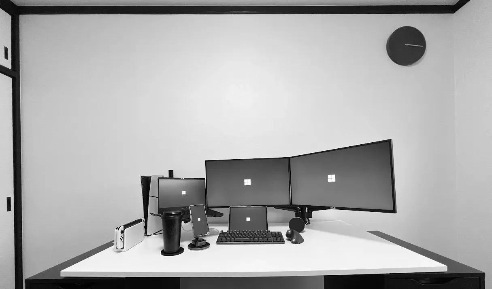

<h1 align="center">Hi 👋, I'm Aomaru - 蒼丸</h1>

<h2>About me</h2>
<ul>
    <li>From Japan🗾, stepping into the IT world💻</li>
    <li>Becoming a “saikyou-muteki” full-stack engineer - ultimate, unstoppable, and unbeatable ⚔️🔥</li>
</ul>

<h2>Hobby projects</h2>
<ul>
    <li>
        <b>Homelab infrastructure🏠</b> - PowerDNS, Kea, Ansible, step-ca, Grafana, etc.
    </li>
    <li>
        <b>Booking Platform for Exclusive Services💋</b> - Vue.js, Express, TypeScript
    </li>
</ul>

<h2>Certifications</h2>
<ul>
    <li>
        AWS Certified Solutions Architect - Associate
    </li>
    <li>
        Google Cloud - Associate Cloud Engineer
    </li>
    <li>
        ORACLE MASTER Gold DBA 2019
    </li>
    <li>
        応用情報技術者試験🇯🇵
    </li>
    <li>
        情報処理安全確保支援士試験🇯🇵
    </li>
</ul>
    
<h2>My skills</h2>

    
     
    

<h2>My Setup 🖥️</h2>

Not directly related to IT… but my favorite environment.

    

